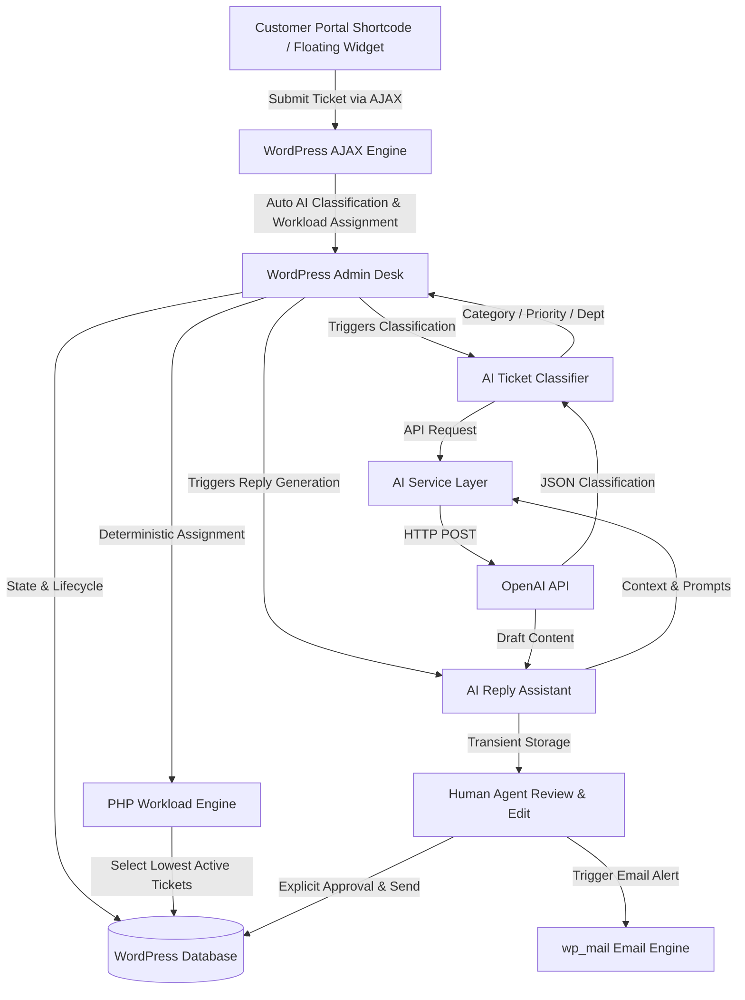

# AI Support Assistant

A production-minded, **WordPress-native customer support platform** combining custom PHP/WordPress database architecture, deterministic workload management, OpenAI-powered AI intelligence, modern sleek UI design, and frontend customer interaction channels.

> **Portfolio Project Note**: Built as a native WordPress plugin using PHP, MySQL, Vanilla CSS (modern design system), and the official OpenAI API. Demonstrates standard WordPress plugin engineering, security practices, and practical AI application design without requiring external Python, Node.js, or FastAPI server dependencies.

---

## 🏗️ Architecture Overview



### Key Architectural Separation
- **AI / LLM Role**: Language processing, intent analysis, text classification, and customer-support response drafting.
- **PHP / WordPress Role**: Business logic execution, database persistence, state management, security validation, and **deterministic user assignment**.
- *The AI never executes database updates directly, never selects WordPress user IDs, and never sends customer responses automatically.*

---

## ✨ Features

### 🎨 Modern UI/UX Design System
- **Google Inter Typography**: Integrated Inter font stack (`-webkit-font-smoothing: antialiased`) for clean typography across all WordPress themes.
- **Gradient Glassmorphism Headers**: Sleek dark indigo banner headers (`linear-gradient(135deg, #0f172a 0%, #1e1b4b 100%)`) with `✨ AI Powered` badges.
- **Interactive Floating Widget**: Pulsing launcher button (`@keyframes aiPulseGlow`) with SVG icons, hover elevation, and pop-in modal transitions (`@keyframes aiWidgetPopIn`).
- **Styled Form Controls**: Custom rounded inputs (`border-radius: 10px`) with off-white backgrounds and vibrant focus glow outlines (`box-shadow: 0 0 0 3.5px rgba(99, 102, 241, 0.15)`).
- **Status Pills**: Styled color-coded status badges (`Open` emerald, `Pending` amber, `Closed` slate).

### 💻 Customer Frontend Channels & Auto-Provisioning
- **Option A: Customer Support Portal Shortcode (`[ai_support_tickets]`)**: Embed a full customer support dashboard onto any page or post. Customers can create tickets, track open ticket statuses, view conversation timelines, and send replies.
- **Option B: Floating Support Desk Widget**: Displays an interactive floating support button on the bottom corner (`bottom-right` or `bottom-left`) of the website for instant AJAX ticket submission.
- **Auto-Created Support Desk Page**: Automatically detects or programmatically creates a published WordPress page titled *"Support Desk"* containing `[ai_support_tickets]` upon plugin setup.
- **In-Place Confirmation & Success Link**: Ticket submission renders a clean confirmation card featuring a direct link to **[Support Desk]** for progress tracking without abrupt page reloads.
- **Real-Time AJAX Polling**: Single ticket view automatically polls (`setInterval` every 3 seconds) for new agent responses, dynamically rendering message bubbles in real-time.

### 🎫 Ticket Management
- Custom database tables (`wp_ai_support_tickets`, `wp_ai_support_messages`).
- Ticket lifecycle states: `open`, `in_progress`, `pending`, `resolved`, `closed`.
- Workload-aware state transitions (closing decrements agent active tickets; reopening increments active tickets).
- Priority levels (`low`, `medium`, `high`, `urgent`) and categorizations.

### 📧 Email Notifications
- Native `wp_mail()` email notification dispatch to customers when a support agent posts a reply on their ticket.

### 👥 Agent & Department Management
- Support departments (`Technical`, `Billing`, `Shipping`, `Returns`, `General`).
- Support agent assignment linked to WordPress User accounts.
- Availability toggle (`Available` / `Unavailable`).
- Real-time active ticket workload tracking with automatic synchronization options.
- **Deterministic Workload Assignment**: Auto-assigns tickets to the available agent with the lowest active ticket count in the target department.

### 🤖 AI Ticket Classification
- Extracts ticket subject and recent conversation history.
- Classifies into standardized categories, priorities, departments, customer sentiment (`positive`, `neutral`, `negative`), and human review indicators (`needs_human`).
- **Server-Side Validation**: All AI JSON output is parsed, sanitized, and validated against allowed enums. Departments map to actual database records with fallbacks to `General`.

### ✍️ AI Reply Assistant (Human-in-the-Loop)
- Generates context-aware, professional support reply drafts based on conversation history and classification metadata.
- **Strict Prompt Guardrails**: Prohibits fabricating order numbers, tracking information, pricing, or falsely claiming refunds/actions were completed.
- **Safety First**: Drafts are saved in transient storage and populated into the reply box for **mandatory human review and editing** prior to sending.

### ⚙️ Centralized Settings & Security
- Registered using the native WordPress Settings API.
- Password-masked API key field preventing secret exposure in UI, logs, or frontend scripts.
- Configurable model selection (defaults to `gpt-4o-mini`), temperature, max tokens, and HTML5 integer step validation.
- Master AI toggle, individual feature switches, and customer frontend controls.
- One-click **⚡ Test AI Connection** diagnostic tool.

---

## 🔐 Security Implementation

- **API Key Confidentiality**: Stored strictly server-side in `wp_options`. Never localized to JavaScript, exposed in REST endpoints, printed in HTML, or written to debug logs.
- **Authorization & Capability Checks**: All administrative actions enforce `current_user_can('manage_options')`. Customer portal endpoints enforce ownership checks (`customer_id === get_current_user_id()`).
- **CSRF Protection**: All forms and AJAX calls verify WordPress nonces (`wp_nonce_field` / `check_ajax_referer`).
- **Input Sanitization & Output Escaping**: Input parameters sanitized with `sanitize_text_field()`, `absint()`, `sanitize_textarea_field()`, `sanitize_email()`. Output escaped with `esc_html()`, `esc_attr()`, `esc_textarea()`.
- **Untrusted AI Handling**: AI responses are treated as untrusted text strings. Code block wrappers are stripped, JSON is strictly decoded, and fields are bounded against PHP enums.

---

## 🛠️ Key Engineering Decisions (Interview Q&A)

### 1. Why build a native WordPress/PHP plugin instead of a Python/FastAPI backend?
> **Answer**: Portability and architectural fit. Building natively in PHP demonstrates full-stack WordPress mastery—custom tables, Settings API, database abstraction, and HTTP APIs—while calling OpenAI directly from PHP. It removes infrastructure overhead, external server hosting costs, and authentication friction between microservices.

### 2. Why is agent assignment handled deterministically by PHP rather than by the LLM?
> **Answer**: Security and predictability. LLMs can hallucinate user IDs or invent non-existent agents. PHP queries the database deterministically (`WHERE department_id = %d AND is_available = 1 ORDER BY active_tickets ASC LIMIT 1`) to guarantee accurate workload distribution and strict access control.

### 3. Why are AI reply drafts forced through human-in-the-loop review?
> **Answer**: Brand safety and liability. Support emails can create binding commitments. Forcing human review ensures agents verify facts before communicating with customers, preventing AI hallucinated policy or refund promises from reaching buyers.

### 4. Why use transient storage for AI reply drafts?
> **Answer**: Performance and zero database bloat. Drafts are temporary working data for the current agent session. Transients (`ai_draft_{$ticket_id}_{$user_id}`) automatically expire in 1 hour and clear upon reply submission without mutating the database schema.

---

## 📊 Database Schema

```sql
-- Tickets Table
CREATE TABLE wp_ai_support_tickets (
    id BIGINT UNSIGNED NOT NULL AUTO_INCREMENT,
    customer_id BIGINT UNSIGNED NULL,
    subject VARCHAR(255) NOT NULL,
    status VARCHAR(30) NOT NULL DEFAULT 'open',
    priority VARCHAR(20) NOT NULL DEFAULT 'medium',
    category VARCHAR(50) NULL,
    department_id BIGINT UNSIGNED NULL,
    assigned_agent BIGINT UNSIGNED NULL,
    created_at DATETIME NOT NULL DEFAULT CURRENT_TIMESTAMP,
    updated_at DATETIME NOT NULL DEFAULT CURRENT_TIMESTAMP,
    PRIMARY KEY (id),
    KEY customer_id (customer_id),
    KEY department_id (department_id),
    KEY assigned_agent (assigned_agent),
    KEY status (status)
);

-- Messages Table
CREATE TABLE wp_ai_support_messages (
    id BIGINT UNSIGNED NOT NULL AUTO_INCREMENT,
    ticket_id BIGINT UNSIGNED NOT NULL,
    sender_id BIGINT UNSIGNED NULL,
    sender_type VARCHAR(20) NOT NULL DEFAULT 'customer',
    message LONGTEXT NOT NULL,
    created_at DATETIME NOT NULL DEFAULT CURRENT_TIMESTAMP,
    PRIMARY KEY (id),
    KEY ticket_id (ticket_id)
);

-- Departments Table
CREATE TABLE wp_ai_support_departments (
    id BIGINT UNSIGNED NOT NULL AUTO_INCREMENT,
    name VARCHAR(100) NOT NULL,
    slug VARCHAR(100) NOT NULL,
    created_at DATETIME NOT NULL DEFAULT CURRENT_TIMESTAMP,
    PRIMARY KEY (id),
    UNIQUE KEY slug (slug)
);

-- Agents Table
CREATE TABLE wp_ai_support_agents (
    id BIGINT UNSIGNED NOT NULL AUTO_INCREMENT,
    user_id BIGINT UNSIGNED NOT NULL,
    department_id BIGINT UNSIGNED NULL,
    is_available TINYINT(1) NOT NULL DEFAULT 1,
    active_tickets INT UNSIGNED NOT NULL DEFAULT 0,
    created_at DATETIME NOT NULL DEFAULT CURRENT_TIMESTAMP,
    PRIMARY KEY (id),
    UNIQUE KEY user_id (user_id),
    KEY department_id (department_id),
    KEY is_available (is_available)
);
```

---

## 🚀 Installation & Setup

1. **Download / Clone** the repository into your WordPress plugins folder:
   ```bash
   cd wp-content/plugins/
   git clone https://github.com/Anuu-RAG/AI-Support-Assistant.git
   ```
2. **Activate Plugin**: Go to **WordPress Admin → Plugins** and activate **AI Support Assistant**.
3. **Configure API & Frontend**:
   - Go to **AI Support → Settings**.
   - Enter your OpenAI secret key (`sk-...`).
   - Check **Enable AI System**, **Enable Customer Portal Shortcode**, and **Enable Floating Support Desk Widget**.
   - Click **Save Changes**.
   - Click **⚡ Test AI Connection** to verify connection.
4. **Support Desk Page**:
   - The plugin automatically creates and publishes a page named **"Support Desk"** with shortcode `[ai_support_tickets]`.
   - Alternatively, insert `[ai_support_tickets]` on any custom page or post.
5. **Set Up Agents & Departments**:
   - Go to **AI Support → Agents**.
   - Verify default departments (`Technical`, `Billing`, `Shipping`, `Returns`, `General`) or add custom ones.
   - Assign a WordPress user as a Support Agent and select their department.

---

## 🧪 Demo Walkthrough Scenario

1. **Customer Submit via Portal / Widget**: Customer submits a support request.
   - **Subject**: `Charged twice for my order`
   - **Message**: `I checked my statement and I was billed twice for order #1234. Please refund the extra charge.`
2. **AI Classification & Auto Assignment**: Upon submission, the plugin automatically runs AI classification and assigns the best available Billing agent.
3. **Admin Desk View**: Open **AI Support → Tickets** in WordPress Admin.
   - *Result*: Classification detects Category `Billing`, Priority `High`, Department `Billing`, Sentiment `Negative`, Needs Human `Yes`.
4. **AI Reply Drafting**: Click **⚡ Generate AI Reply Draft**.
   - *Result*: AI generates a polite, empathetic draft acknowledging the double-charge inquiry and asking for transaction confirmation without falsely claiming a refund was already processed.
5. **Review & Send**: The agent reviews the text, modifies any details, and clicks **Send Reply**.

---

## 📁 Project Structure

```
ai-support-assistant/
├── ai-support-assistant.php       # Main plugin bootstrap & entrypoint
├── README.md                      # Documentation & portfolio showcase
├── .gitignore                     # Git exclusion rules
├── includes/
│   ├── class-database.php         # DB table creation & dbDelta migration
│   ├── class-settings.php         # WordPress Settings API & configuration accessors
│   ├── class-ai.php               # OpenAI API HTTP service layer & logging
│   ├── class-classifier.php       # AI Ticket Classifier & server validation
│   ├── class-ai-reply.php         # AI Reply Draft Generator & transient store
│   ├── class-frontend.php         # Customer Portal shortcode & Floating Widget engine with modern UI
│   ├── class-tickets.php          # Ticket lifecycle & workload state transitions
│   └── class-agents.php           # Department & agent workload management
└── admin/
    ├── class-admin.php            # Admin menu, POST action router & notices
    └── views/
        ├── tickets.php            # Tickets listing table view
        ├── ticket-new.php         # Ticket creation form view
        ├── ticket-single.php      # Ticket detail, conversation & AI assistant view
        ├── agents.php             # Agent & department management view
        └── settings.php           # Plugin settings form & connection test view
```

---

## 🔮 Future Improvements (V2 Roadmap)

- **WooCommerce Integration**: Fetch customer order history, shipping status, and line items to inject real order context into AI prompts.
- **Support Knowledge Base (RAG)**: WordPress Custom Post Type for support policies with semantic text retrieval.
- **Agent Analytics Dashboard**: Visual metrics for resolution time, customer sentiment trends, and department workloads.

---
